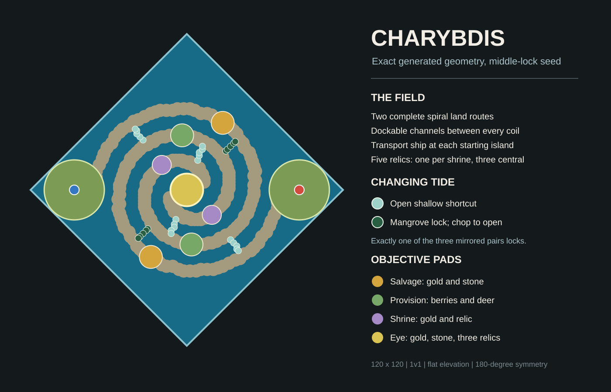

# Charybdis



`Charybdis` is an experimental 1v1 hybrid random map for **Age of Empires II:
Definitive Edition**. Two interlocking stone spirals curl through a fully
navigable sea and meet at a resource-rich central eye. Each player has a
complete land route to the middle, but starting Transport Ships and cross-coil
shortcuts make following the road optional.

## Core Mechanic

Three rotationally mirrored shortcut pairs cross neighboring coils. On every
seed, two pairs are open shallows and one pair is a mangrove lock. The locked
pair begins obstructed by harvestable mangrove trees. Cutting a narrow opening
changes the map during play by creating a shorter route for land units and a
crossing for ships.

The locked pair is selected with a `33% / 34% / 33%` split. Player colors also
swap sides independently, while all authored geometry remains exactly
180-degree rotationally symmetric.

## Opening

Each player receives:

| Item | Amount |
| --- | ---: |
| Town Center | 1 |
| Villagers | 6 |
| Houses | 2 |
| Scout | 1 |
| Transport Ship | 1 |
| Sheep | 8 |
| Boar | 2 |
| Deer | 4 |
| Forage bushes | 6 |
| Home gold | 15 tiles |
| Home stone | 9 tiles |
| Home forest | about 135 trees in 3 clumps |
| Extra stragglers | 6, plus the villager anchor tree |
| Shore fish | 8 |
| Nearby deep fish | 10 |

The coils add two mirrored salvage pads with gold and stone, two provision
pads with berries and deer, and two shrines containing gold and one relic each.
The central eye contains more gold and stone plus three relics. There are five
relics and 24 additional neutral deep-sea fish in total.

## Settings

- **Game mode:** Random Map
- **Players:** exactly 2
- **Map size:** Tiny (`120 x 120` is enforced by the script)
- **Resources:** Standard
- **Reveal map:** Normal is recommended
- **Victory:** Standard or Conquest

Regicide is supported with one King per player. The script does not alter unit,
building, technology, or resource behavior.

## Install

Download [`Charybdis.rms`](./Charybdis.rms) and place it in:

```text
%USERPROFILE%\Games\Age of Empires 2 DE\<player-id>\resources\_common\random-map-scripts\
```

This is the same custom RMS folder that works through GeForce Now. In the
skirmish lobby, choose **Custom** map style and select **Charybdis**.

## Development

The checked-in RMS and SVG are generated from one geometry model:

```bash
node tools/generate-map.mjs
node tools/generate-map.mjs --check
node tools/validate-rms.mjs
bash tools/package.sh
```

The map-specific validator checks syntax structure, exact generated geometry,
rotational symmetry, route continuity, tide-state logic, resource counts,
forest allocation, and fish spacing. Independent parser results are recorded
in [`VALIDATION.md`](./VALIDATION.md).

Static validation cannot execute the closed-source AoE2 map generator. Complete
the tests in [`RUNTIME-TEST.md`](./RUNTIME-TEST.md) before treating this first
release candidate as runtime-approved.

## License

The original map and its project tooling are released under the MIT License.
The retained community validators in the parent workspace keep their own
upstream licenses and are not part of this repository.
